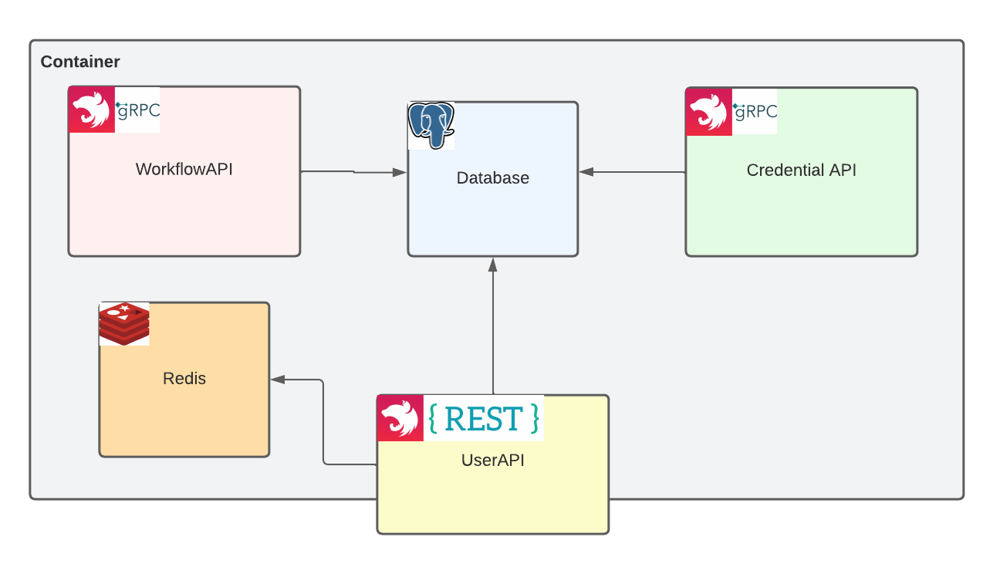

# Area backend

## Introduction

Area is an ifttt-like project, as a SaaS, every business logic components are splits into their own services.

We currently have three services:

- [`UserAPI`](./userAPI): Manage user and gateway to other services
- [`WorkflowAPI`](./workflowAPI): Manage workflows and actions/reactions
- [`CredentialAPI`](./credentialAPI): CredentialAPI

WorkflowAPI and CredentialAPI stands as microservices and use [gRPC](https://grpc.io)
to communicate each other.

Each services, use the same `PostgreSQL` database but each one are stored in a different schema keep single
responsibility principle.

Here's a simple schema of the backend architecture.



## Services

### User API

User API is responsible for user management, authentication and act as a Gateway to interact with Workshop API and
Credential API.

A Swagger is available on `/docs` with a complete list of all endpoints.

#### How to run in development mode

Since it's fully dockerized, you can just use the [`docker-compose.dev.yaml`](./userAPI/docker-compose.dev.yaml)
to run the whole infrastructure required to develop.

```shell
cd userAPI

# Use direnv to load environment
# Indeed, you must create a .env
direnv allow

# Install dependencies
yarn

# Run architecture
yarn infra:dev:up

# Start in dev mode
yarn start:dev
```

### Credential API

Credential API is in charge of credential storage and management.<br>
It's a gRPC API that follow [area.credential protobuf definition](./protos-ts/credential.proto).

There are two entities in that service : `Storage` and `Credential`.

`Storage` is a simple vault that contains multiple `Credential`.<br>
It always belongs to a user and there can be only one storage by user.

`Credential` is a simple key value entity that store a [service](./protos-ts/credential.proto) and the corresponding
token's value.

Credential API supports a limited list of service, currently there are :

- `GOOGLE`
- `SCALEWAY`
- `COINMARKET`
- `DOCKER`
- `ETH`
- `NOTION`
- `GITHUB`

:warning: Trying to store a token for another service than those above will fail.

#### How to run in development mode

Since it's fully dockerized, you can just use the [`docker-compose.dev.yaml`](./credentialAPI/docker-compose.dev.yaml)
to run the whole infrastructure required to develop.

```shell
cd credentialAPI

# Use direnv to load environment
# Indeed, you must create a .env
direnv allow

# Install dependencies
yarn

# Run architecture
yarn infra:dev:up

# Start in dev mode
yarn start:dev
```

### Workflow API

Workflow API is in charge of workflow storage and tasks management.<br>
It's a gRPC API that follow [area.workflow protobuf definition](./protos-ts/workflow.proto)
and [area.task protobuf definition](./protos-ts/task.proto).

There are two entities in that service : `Workflow` and `Task`.

`Workflow` is a simple entity that contains multiple `Task` as a linked list.<br>
It always belongs to a user and a user can have multiple workflows.

`Task` is an entity that defines a task that must be consumed by [obelix](../obelix).<br>
Task can either be a reaction or an action, everything is defines in `TaskAction`.

#### How to run in development mode

Since it's fully dockerized, you can just use the [`docker-compose.dev.yaml`](./workflowAPI/docker-compose.dev.yaml)
to run the whole infrastructure required to develop.

```shell
cd workflowAPI

# Use direnv to load environment
# Indeed, you must create a .env
direnv allow

# Install dependencies
yarn

# Run architecture
yarn infra:dev:up

# Start in dev mode
yarn start:dev
```

## Assets

### Protos-ts

Define and generate typescript file from protobuf definition

```shell
cd protos-ts

./gen.sh
```

:warning: Don't forget to update code that depends on:
- Don't remove NestJS decorator
- Update enumeration in userAPI, workflowAPI and credentialAPI if you update an enum
- Update schema prisma if necessary

### Utils

Contains important shells script to correctly wait for dependant services

- [wait-for-api](./util/wait-for-api.sh): Wait for a http endpoint using curl and a simple for loop
- [wait-for-it](./util/wait-for-it.sh): Wait for a process to be up in a network