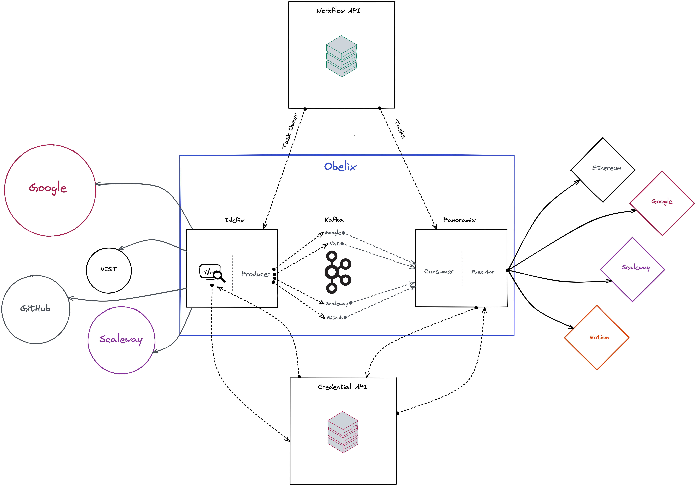

# Obelix

## Description

Obelix is composed of two sub microservices :

- Idefix
- Panoramix

Obelix's purpose is to trigger actions and execute reactions.
It uses the Credential API to query credentials in order to perform authenticated requests to service.

## Idefix

Idefix is the microservice responsible for watching service's state.
It looks for every user's action using the Workflow API and fetch their state.

If this state differs from the previous one it has in memory (represented by a Redis entry), it sends the current 
action in Kafka as the message.
This message contains the triggered action - aka the workflow head - so that Panoramix can execute reactions later on.

Each triggered action is sent in a specific tunnel - the Kafka topic - corresponding to the service's name.

## Panoramix

Panoramix is the microservice responsible for executing reactions after an action triggers.

It consumes Kafka topics concurrently to increase performance. Whenever a message has been consumed, it can execute 
the following reactions one after the other.

It uses the Credential API to perform authenticated POST requests to service.

## Architecture

The code also has a specific architecture.
Both Idefix and Panoramix use a method dispatcher which maps a service name to its attached actions.

The message sent to Kafka always has the following format : SERVICE_METHOD.
It follows the principle of Remote Procedure Call.